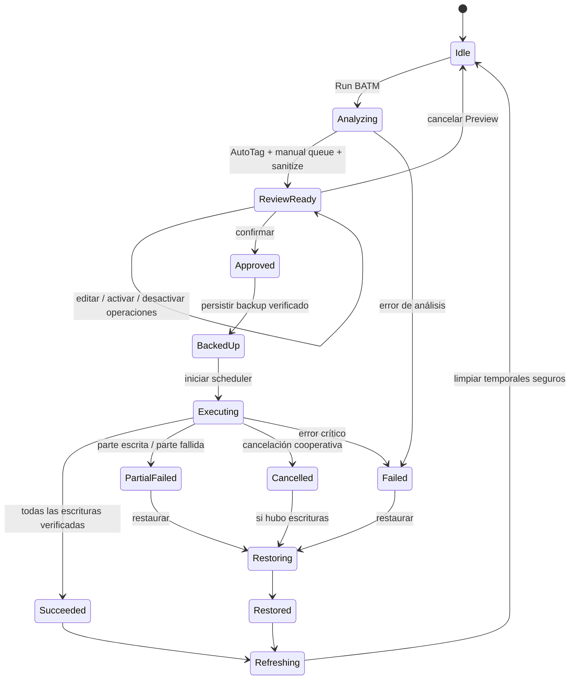

# BATM v4.x — análisis técnico previo a implementación

Fecha del análisis: 6 de agosto de 2026  
Fuentes analizadas:

- `ssot_batm_blender_manager.txt` — especificación normativa y fuente de verdad (BATM v4.x).
- `monohiloreferenceBATM.py` — referencia funcional histórica (BATM 2.2.0 para Blender 4.2).
- Comprobación directa contra Blender 5.2.0 LTS Release Candidate, hash `002c1d778c1e`.

Este documento no implementa el addon. Define qué debe construirse, qué puede rescatarse del prototipo y qué decisiones deben cerrarse antes de programar.

## 1. Conclusión ejecutiva

BATM v4.x debe ser un sistema transaccional de edición masiva de Tags, no una colección de botones que escriben directamente en los assets. Su unidad conceptual es una sesión de cambio formada por:

1. una selección congelada de assets;
2. snapshots de sus Tags originales;
3. propuestas de AutoTag y operaciones manuales;
4. una reducción sanitizada a un estado final por asset;
5. un Preview editable y explícitamente aprobado;
6. un backup persistido antes de cualquier escritura;
7. una ejecución por archivos `.blend`, con progreso y resultados verificables;
8. refresh del Asset Browser y limpieza solo después de un resultado confirmado.

El script 2.2.0 demuestra ideas valiosas —agrupación por `.blend`, procesos headless, lectura de `AssetRepresentation`, temporizadores, progreso y sanitización básica—, pero contradice requisitos esenciales del SSOT: incluye modo inmediato, no tiene Preview real, no implementa backup/restore y mezcla UI, estado, ejecución e infraestructura en un único módulo.

La recomendación es una reimplementación modular. No conviene refactorizar el archivo monolítico como base principal; sí conviene trasladar selectivamente conceptos y casos de prueba.

## 2. Jerarquía de autoridad

Cuando TXT y PY difieren:

- prevalece siempre el TXT;
- el comportamiento del PY solo prueba que una aproximación fue ensayada históricamente;
- ningún comportamiento del PY se convierte en requisito por existir en el código;
- las lagunas del TXT deben resolverse mediante decisiones explícitas, no copiando silenciosamente el legado.

La regla más importante del SSOT es absoluta: ninguna herramienta escribe Tags antes de Preview y aprobación. Esto elimina de v4.x tanto el modo `INSTANT` como cualquier botón por asset que invoque directamente el procesador.

## 3. Objetivo, alcance y límites

### Objetivo

Gestionar de forma consistente y segura las Tags de cientos o miles de assets distribuidos en bibliotecas Blender, evitando abrir manualmente cada `.blend`.

### Único dato modificable

BATM puede analizar nombres, tipos de ID, tipos de objeto, composición, biblioteca y otros datos públicos, pero solo puede escribir la colección de Tags del metadata del asset.

Quedan fuera de alcance:

- geometría y relaciones de objetos;
- materiales y nodos;
- animaciones y rigs;
- catálogo y `catalog_id`;
- nombres de datablocks;
- previews gráficos o thumbnails;
- configuración de importación del asset;
- cualquier otro metadata que no sea Tags.

El término **Preview** en BATM significa la vista previa del cambio Antes/Después; no significa la imagen de preview del asset.

### Propiedades de calidad

- determinismo: la misma entrada y configuración producen el mismo resultado;
- trazabilidad: cada Tag final puede explicarse por una operación o regla;
- idempotencia: repetir el mismo plan no crea cambios adicionales;
- aislamiento: un asset no seleccionado nunca se modifica;
- recuperación: existe información suficiente para restaurar Tags ya escritos;
- escalabilidad: el modelo no depende de que todos los assets estén visibles a la vez.

## 4. UX normativa

La interfaz principal tiene tres bloques visibles y un cuarto bloque normalmente oculto.

### 4.1 Métricas

Solo lectura:

- biblioteca activa;
- total de assets de la biblioteca activa;
- assets seleccionados.

Debe reaccionar a cambios de contexto sin mutar propiedades durante `Panel.draw()`. El script histórico hace lo contrario: desde `draw_safe()` persiste selección y puede lanzar un operador de análisis (PY 2705–2725). En v4.x, `draw()` debe limitarse a representar un snapshot ya calculado por un controlador/timer.

### 4.2 Run BATM

Es el único punto de entrada a una ejecución completa. Inicia dos fases visibles y separadas:

- **análisis AutoTag**, con progreso propio;
- **procesamiento aprobado**, con un nuevo progreso basado en escrituras realmente terminadas.

Entre ambas siempre aparece Preview. Si no hay operaciones efectivas después de sanitizar, Run debe terminar sin crear backup ni abrir procesos de escritura.

### 4.3 Manual Tag Editor

Debe ofrecer:

- Tags comunes a todos los seleccionados;
- Tags parciales o individuales, con cobertura `n/N`;
- selección múltiple;
- búsqueda y filtrado;
- adición de una o varias Tags;
- eliminación;
- reemplazo de una Tag por una o varias nuevas.

Cada acción edita exclusivamente la cola pendiente. No existe aplicación inmediata, ni siquiera desde el inspector de un asset individual.

### 4.4 Diagnostics & Logs

Oculto por defecto, pero accesible manualmente y abierto automáticamente cuando existan advertencias, errores, conflictos de archivos o un backup recuperable.

Debe distinguir:

- diagnóstico del dataset antes de ejecutar;
- eventos de la ejecución;
- resultados por archivo y por asset;
- estado del backup/restore;
- información técnica exportable.

## 5. Flujo y máquina de estados



Estados recomendados para una sesión: `IDLE`, `ANALYZING`, `REVIEW_READY`, `APPROVED`, `BACKING_UP`, `BACKED_UP`, `EXECUTING`, `CANCEL_REQUESTED`, `SUCCEEDED`, `PARTIAL_FAILED`, `FAILED`, `RESTORING`, `RESTORED`, `REFRESHING`.

Transiciones inválidas deben rechazarse. Por ejemplo, `EXECUTING` no puede alcanzarse sin una revisión de cola y un backup confirmado.

## 6. Modelo de dominio y estado

### 6.1 Identidad del asset

El nombre no es suficiente. La clave estable mínima debe ser:

```text
AssetKey = (
    library_reference,
    resolved_blend_path,
    id_type,
    datablock_name,
)
```

Se puede adjuntar `catalog_id` para contexto, pero no debe formar parte de la identidad de escritura porque BATM no modifica catálogos.

El legado usa solo `asset_repr.name` en varios mapas y, dentro del worker, busca ese nombre en numerosas colecciones de IDs (PY 422–428 y 648–659). Esto puede modificar varios datablocks homónimos de tipos distintos. v4.x debe transportar y validar siempre `id_type`.

### 6.2 Snapshot

Por asset:

- `AssetKey`;
- Tags originales en orden;
- metadata público necesario para AutoTag;
- hechos derivados de análisis;
- `mtime`, tamaño y fingerprint lógico del `.blend`;
- estado de accesibilidad y escritura;
- origen local, externo, Essentials u online.

Los punteros RNA como `local_id` y `AssetRepresentation` son efímeros y no deben persistirse como identidad.

### 6.3 Operación pendiente

Campos recomendados:

- UUID de operación;
- origen: `AUTO`, `MANUAL` o `PREVIEW`;
- tipo: `ADD`, `REMOVE`, `REPLACE`;
- conjunto explícito de `AssetKey` objetivo;
- payload de entrada y salida;
- habilitada/deshabilitada;
- orden o prioridad;
- explicación de la regla;
- advertencias de sanitización;
- revisión que la creó o modificó.

No es necesario conservar operaciones de casing/sort como mutaciones independientes al escribir. Conviene compilar la cola a un **estado final deseado de Tags por asset**. El worker recibe `before_fingerprint` y `desired_tags`, verifica que el estado no cambió y aplica un único reemplazo determinista.

### 6.4 Estado de UI y persistencia

- `WindowManager` o un controlador Python: sesión transitoria, selección congelada y progreso.
- `AddonPreferences`: configuración persistente del usuario.
- archivos JSON versionados: backups, resultados y logs recuperables.
- nunca `Scene` para la cola o progreso transitorio.

El legado guarda casi todo en `Scene.bam_lite_props` (PY 1238–1362). Si el archivo actual se guarda, ese estado puede contaminar el `.blend`, contrario al alcance minimalista de BATM.

## 7. Selección, lectura de assets y métricas

### Lectura de selección en Blender 5.2

La vía pública correcta es el contexto del Asset Browser:

- `context.selected_assets` → `AssetRepresentation`;
- `context.asset` → asset activo;
- `AssetRepresentation.name`;
- `AssetRepresentation.id_type`;
- `AssetRepresentation.local_id`;
- `AssetRepresentation.full_library_path`;
- `AssetRepresentation.metadata.tags`;
- en 5.2, `owner_asset_library` e `is_online`.

Para leer Tags no hace falta construir un mapa paralelo con `context.selected_files`. El legado depende de `FileSelectEntry.asset_data` para assets externos (PY 1680–1699), lo que es más frágil y además indexa por nombre. `AssetRepresentation.metadata.tags` sirve como representación pública común de lectura.

### Rutas

Debe usarse `full_library_path` como ruta del `.blend`. El recorte histórico `raw_path.split(".blend")[0] + ".blend"` (PY 1827–1832) falla si un directorio contiene `.blend` o si la ruta tiene una forma no prevista.

### Biblioteca activa en 5.2

Usar `context.asset_library_reference` o `FileAssetSelectParams.asset_library_reference`. El legado consulta `asset_library_ref` (PY 387–395 y 867–875), propiedad que no existe con ese nombre en el RNA comprobado de Blender 5.2.

Blender 5.2 también cambió el significado del índice `PreferencesFilePaths.active_asset_library`: ahora la lista incluye “All Libraries” y “Essentials”. No deben codificarse offsets ni asumir que el índice coincide únicamente con bibliotecas de usuario.

### Total de assets

El total exacto de una biblioteca no aparece como una colección pública trivial del contexto del Asset Browser. Para bibliotecas de usuario, una solución compatible es un inventario asíncrono y cacheado:

1. resolver el root de la biblioteca;
2. enumerar `.blend`;
3. consultar cada archivo con `bpy.data.libraries.load(path, assets_only=True)`;
4. sumar IDs marcados como asset;
5. invalidar por cambios de ruta, fecha o tamaño.

No debe hacerse dentro de `draw()`. “All Libraries”, Essentials, archivos archive y assets online requieren métricas con estado `no disponible`, `parcial` o una estrategia específica; el SSOT debe aclarar si “total” significa todos los assets indexados, todos los visibles tras filtros o solo la biblioteca de usuario activa.

### Congelación de alcance

Al iniciar Run, BATM captura una selección inmutable. Cambios posteriores en el Asset Browser no alteran el trabajo en curso. Assets online, Essentials, rutas inexistentes o archivos no escribibles se detectan en preflight y nunca llegan silenciosamente al procesador.

## 8. AutoTag

AutoTag tiene dos etapas diferentes:

### Extracción de hechos

Determinista y sin escritura:

- tokens del nombre del asset;
- `id_type`;
- para objetos: tipo de objeto y tipo de datos;
- para colecciones: número y tipos de objetos;
- biblioteca y ruta;
- otros datos públicos previstos por el SSOT.

Para assets externos, agrupar por `.blend` y abrir cada archivo una sola vez en un Blender headless de análisis. Nunca guardar el archivo durante AutoTag.

### Reglas de generación

Las reglas transforman hechos en candidatos y deben devolver también una explicación. Ejemplo:

```text
Environment_OakTree
  nombre → Environment, Oak, Tree
  id_type → Object
  object.type → Mesh
  taxonomía Oak/Tree → Nature
```

“Nature” no proviene directamente de la API; exige un diccionario o taxonomía explícita. También hace falta separar PascalCase/camelCase para obtener `Oak` y `Tree`. El legado únicamente convierte el nombre completo a Title Case y, si se sanitiza, cambia `_` por espacio; no implementa el análisis del ejemplo del SSOT.

Las reglas de AutoTag deben ser configurables, versionadas y comprobables. No hay requisito de red, IA generativa ni servicios externos.

## 9. Manual Tag Editor

Construir un índice de frecuencia `tag_casefold -> {assets}` sobre los snapshots:

- común: cobertura `N/N`;
- parcial: cobertura entre `1/N` y `(N-1)/N`;
- individual: caso particular `1/N`.

La búsqueda filtra este índice, no vuelve a consultar Blender en cada redraw. Las operaciones se aplican a un conjunto explícito de assets y se pueden combinar con AutoTag.

El reemplazo debe soportar una Tag de origen y una o varias Tags destino. Deben definirse los casos de coincidencia exacta, sensibilidad a mayúsculas y colisiones después de normalizar.

## 10. Sanitización

Debe actuar sobre la cola/salida propuesta, nunca sobre los assets reales antes de aprobar.

Pipeline recomendado:

1. tokenizar entradas multi-Tag con separadores configurados;
2. recortar y colapsar whitespace;
3. eliminar vacíos;
4. aplicar la política de separadores;
5. aplicar casing (`Title Case`, `snake_case`, `camelCase`, etc.);
6. deduplicar mediante `casefold()` conservando una representación canónica;
7. resolver operaciones redundantes o contradictorias;
8. generar `desired_tags` y diff Antes/Después.

El orden importa y debe quedar cubierto por tests. El legado elimina apóstrofes y convierte `_`/`-` a espacios (PY 158–217), una transformación potencialmente destructiva para nombres técnicos y lenguas naturales. No debe heredarse como política fija.

El SSOT no define:

- caracteres o longitudes inválidas;
- si el orden alfabético es obligatorio;
- sensibilidad de replace/remove;
- precedencia cuando la misma Tag se añade y elimina;
- política para Unicode y acrónimos;
- separador por defecto.

Recomendación de precedencia: AutoTag primero, operaciones manuales después, sanitización común y ajustes realizados en Preview como autoridad final. La salida compilada, no el orden incidental de botones, es lo que se ejecuta.

## 11. Preview

Debe mostrar por asset:

- identidad inequívoca: nombre, tipo y archivo;
- Tags Antes;
- Tags Después;
- altas, bajas y reemplazos coloreados o agrupados;
- origen de cada propuesta;
- advertencias y conflictos;
- control de activación por operación/asset.

El usuario puede editar, añadir, eliminar o desactivar. Cada edición incrementa una revisión y vuelve a ejecutar el reductor/sanitizador. El botón Confirmar solo se habilita si el plan es válido y existe al menos un cambio efectivo.

Para miles de assets, no dibujar todas las filas expandidas. Usar `UIList`, filtrado, paginación o secciones virtualizadas y resúmenes agregados.

El “Queue Preview” histórico (PY 2277–2312) solo enumera acciones globales y no muestra Antes/Después ni aprobación. No satisface este requisito.

## 12. Backup y restore

### Contenido mínimo

Manifest JSON versionado por ejecución:

- run/session UUID;
- versión de BATM y Blender;
- timestamp;
- por asset: `AssetKey`, Tags originales y fingerprint pre-ejecución;
- archivos afectados;
- estado de aplicación y restauración por archivo;
- checksum del propio manifest.

El backup debe escribirse de forma atómica y verificarse antes de iniciar el primer worker. Si Blender o BATM se cierran durante la ejecución, el siguiente arranque debe descubrirlo.

### Restore

Restore es otro plan de escritura: agrupa por `.blend`, comprueba identidad/fingerprint, restaura Tags y produce su propio resultado. Nunca elimina el backup hasta verificar la restauración.

### Ambigüedad normativa

El SSOT dice que el backup se elimina tras éxito, pero también que el usuario puede solicitar restauración. Si se borra al finalizar con éxito, no existe undo posterior. Hay que decidir entre:

- rollback solo ante error/cancelación durante la sesión; o
- ventana de retención configurable para permitir restore posterior.

Además, un backup exclusivo de Tags no protege frente a corrupción física del `.blend`. Para seguridad de producción debe decidirse si cada archivo se guarda mediante copia temporal y reemplazo atómico, o si se permite un backup completo opcional. El Undo de Blender no cubre cambios realizados por procesos externos.

## 13. Procesamiento por lotes

### Unidad transaccional

La unidad de exclusión es el archivo `.blend`, no el asset. Todos los assets seleccionados de un mismo archivo se procesan juntos en un solo worker. Nunca deben existir dos procesos escribiendo el mismo archivo.

### Scheduler recomendado

- cola de archivos preparada después del backup;
- límite de procesos Blender simultáneos;
- límite de assets por lote lógico;
- adaptación conservadora según memoria, CPU, duración y fallos;
- `subprocess.Popen` no bloqueante;
- polling desde operador modal o `bpy.app.timers` en el hilo principal;
- cancelación cooperativa: no lanzar trabajo nuevo, finalizar/terminar workers según política y restaurar si procede.

No usar `threading.Thread` para acceder a `bpy`. La documentación oficial advierte que la integración Python de Blender no es thread-safe. El legado llama a `bpy.context.scene` desde su hilo de trabajo a través de `bam_set_job_log()` (PY 1083–1112), por lo que su patrón no es seguro.

### Worker

Un módulo estático, no Python generado dinámicamente:

1. lee request JSON;
2. abre el `.blend` indicado;
3. localiza cada ID por `id_type + name`;
4. verifica Tags/fingerprint esperados;
5. aplica `desired_tags`;
6. guarda;
7. escribe result JSON atómico con contadores y errores;
8. devuelve código de salida no cero si guardar o verificar falla.

El padre no debe interpretar una cadena genérica `SUCCESS` como prueba suficiente.

### Progreso

Separar:

- progreso de AutoTag: assets analizados/total;
- progreso de ejecución: assets confirmados y archivos guardados/total;
- fase actual y archivo activo;
- completados, omitidos, conflictos y fallidos;
- elapsed y ETA suavizada.

Actualizar `WindowManager.progress_begin/update/end` y propiedades UI solo desde el hilo principal.

En el pipeline histórico, `_process_and_count()` incrementa `completed_items` antes de que termine el subprocess (PY 2110–2139), así que el progreso puede llegar a 100 % mientras aún hay escrituras activas.

## 14. Refresh del Asset Browser

Blender 5.2 conserva el operador público `bpy.ops.asset.library_refresh()`. Debe ejecutarse una sola vez con un override válido del Asset Browser y solo después de cerrar todos los workers y consolidar resultados.

No se debe:

- llamar dos veces con ejecución normal e `INVOKE_DEFAULT`;
- dormir el hilo principal con `time.sleep()`;
- deshabilitar y reactivar el addon;
- depender de APIs internas del file list.

El legado hace las cuatro cosas durante finalización (PY 930–960 y 1115–1157).

La restauración histórica usa `bpy.ops.file.select(toggle=True, name=asset_name)` (PY 940–948 y 2819–2825). En Blender 5.2 el operador público `file.select` no tiene parámetro `name`; esas llamadas fallan y son silenciadas. Además, guardar solo nombres no distingue assets homónimos. v4.x debe conservar su propia selección lógica y confiar en que refresh preserve la selección UI cuando sea posible; si Blender no expone restauración pública, no debe simularla mediante internals.

Blender 5.2 añade opciones de refresh para listados remotos y un operador `library_reload_listing`; assets online deben considerarse no escribibles hasta estar materializados localmente.

## 15. Diagnóstico y logging

### Diagnóstico previo

- Tags totales, únicas, duplicadas, vacías e inválidas;
- assets con limpieza propuesta;
- archivos inexistentes, no escribibles o modificados;
- identidades ambiguas;
- assets online/Essentials/read-only;
- operaciones sin efecto o contradictorias;
- espacio de disco y capacidad de crear backup/temporales.

### Log estructurado

Cada evento:

- timestamp UTC;
- run UUID;
- fase;
- severidad;
- archivo y `AssetKey` opcionales;
- código de evento estable;
- mensaje para usuario;
- detalle técnico/excepción separado.

El panel muestra un resumen y permite exportar el JSON/texto completo. No limitar la fuente de auditoría a las últimas 100 líneas en memoria como el legado (PY 1083–1105).

Errores de acción, verificación o guardado deben producir fallo real. El worker histórico imprime `SUCCESS` incluso cuando `save_mainfile()` lanza excepción (PY 760–774) y puede ocultar excepciones por asset, por lo que sus marcadores no son fiables.

## 16. Arquitectura objetivo

El esquema de cinco capas del SSOT es válido con dos correcciones de dependencia.

```text
UI
  ↓
Operators / Application façade
  ↓
Core (session, queue, state, configuration, orchestration)
  ↓
Engines (autotag, reducer/sanitizer, preview, backup, scheduler, processor,
         restore, diagnostics, logging)
  ↓
Adapters / Utilities (Blender API, paths, serialization, timers, subprocess IPC)
```

Correcciones necesarias:

1. El SSOT afirma que una capa solo habla con la inmediatamente inferior, pero después permite que Operators deleguen directamente al Processing Engine. Para mantener la regla, Operators deben llamar a una fachada del Core.
2. El Batch Scheduler aparece como responsabilidad del Core, motor del Processing Engine y archivo `core/scheduler.py`. Debe existir una sola implementación: configuración/estado en Core y ejecución en `engine/scheduler.py`.

Estructura sugerida:

```text
batm/
├── __init__.py
├── blender_manifest.toml
├── ui/
│   ├── panels.py
│   ├── lists.py
│   ├── preview.py
│   └── dialogs.py
├── operators/
│   ├── run.py
│   ├── preview.py
│   ├── manual_tags.py
│   ├── restore.py
│   └── diagnostics.py
├── core/
│   ├── models.py
│   ├── state_machine.py
│   ├── queue.py
│   ├── reducer.py
│   ├── session.py
│   └── preferences.py
├── engine/
│   ├── inventory.py
│   ├── selection.py
│   ├── autotag.py
│   ├── sanitizer.py
│   ├── preview.py
│   ├── backup.py
│   ├── scheduler.py
│   ├── processor.py
│   ├── restore.py
│   ├── diagnostics.py
│   └── logging.py
├── adapters/
│   ├── blender_assets.py
│   ├── blender_context.py
│   ├── worker_ipc.py
│   ├── filesystem.py
│   └── timers.py
├── worker/
│   └── batm_worker.py
└── resources/
    └── autotag_rules.json
```

## 17. Compatibilidad comprobada con Blender 5.2

### Confirmado en el runtime 5.2.0 LTS RC

- El archivo histórico se importa y registra sin error.
- Existen `AssetRepresentation`, `AssetMetaData.tags`, `AssetTag`, `full_library_path`, `id_type` y `local_id`.
- 5.2 añade `AssetRepresentation.owner_asset_library` e `is_online`.
- Existe `FileAssetSelectParams.asset_library_reference` y `asset_catalog_visibility`.
- Existe `bpy.ops.asset.library_refresh()`.
- Existen `WindowManager.progress_begin/update/end` y `bpy.app.timers`.
- `bpy.data.libraries.load(..., assets_only=True)` permite inventariar IDs marcados como assets.
- `bpy.data.all_ids` está disponible en 5.2.
- `bpy.ops.file.select` no acepta `name`.

### Compatibilidad aparente no equivale a funcionamiento

Se generaron y compilaron los scripts que produciría `_WorkerScriptBuilder`:

- `ADD` y `REMOVE`: compilan;
- `CAPITALIZE`, `LOWERCASE`, `UPPERCASE`, `CLEAN`, `SMART_PROJECT`, `SMART_ASSET`, `REPLACE` y `RENAME`: generan `IndentationError` por definiciones `apply_action` duplicadas/vacías;
- el worker pipeline completo compila, pero la cola nunca incorpora correctamente `REPLACE`, y `RENAME` carece de ruta funcional.

Problemas adicionales del legado:

- Queue Replace se serializa como una Tag literal `[REPLACE:old->new]` (PY 1652–1658).
- `pipe_rename_instructions` no está declarado en el PropertyGroup.
- los popups por asset ejecutan directamente incluso en Queue.
- el supuesto modo “monohilo” tiene `ThreadPoolExecutor` y permite hasta 1000 jobs; solo su valor por defecto es 1.
- la lista fija de colecciones ID omite tipos de asset válidos.
- un fallo de guardado sigue devolviendo éxito.
- `UNDO` no revierte archivos externos.

### Extensión oficial

v4.x necesita `blender_manifest.toml`, `blender_version_min = "5.2.0"` y permiso `files` con justificación, ya que lee/escribe bibliotecas y backups. El uso de procesos Blender debe probarse en Windows, macOS y Linux mediante `bpy.app.binary_path`, argumentos sin shell y rutas Unicode.

Referencias oficiales útiles:

- [Blender 5.2 Python API release notes](https://developer.blender.org/docs/release_notes/5.2/python_api/)
- [AssetRepresentation API](https://docs.blender.org/api/5.2/bpy.types.AssetRepresentation.html)
- [Asset operators](https://docs.blender.org/api/5.2/bpy.ops.asset.html)
- [Python threads are not supported](https://docs.blender.org/api/5.2/info_gotchas_threading.html)
- [Blender Extensions: getting started and manifest](https://docs.blender.org/manual/en/5.2/advanced/extensions/getting_started.html)

## 18. Matriz de reutilización del script histórico

| Área histórica | Decisión | Motivo |
|---|---|---|
| Tokenización coma/punto y coma | Reutilizar como test, rediseñar | Falta separador configurable y escaping |
| Normalización whitespace/casefold | Reutilizar concepto | Debe ampliarse a Unicode y más formatos |
| Agrupación por `.blend` | Reutilizar | Es la unidad correcta de exclusión y arranque |
| `AssetRepresentation` | Reutilizar con API 5.2 | Usar metadata, id_type y full_library_path |
| Procesos Blender headless | Reutilizar concepto | Cambiar a worker estático + JSON + Popen |
| `threading`/ThreadPool dentro de Blender | Retirar | Riesgo de thread-safety y acceso a `bpy` |
| Estado global + Scene PropertyGroup | Retirar | Frágil, no transaccional y puede persistir en `.blend` |
| Worker Python generado | Retirar | Duplicación, errores de sintaxis y difícil testeo |
| Modo Instant | Eliminar | Contradice el SSOT |
| Queue Preview textual | Reemplazar | No muestra ni edita Antes/Después |
| Refresh público | Reutilizar de forma mínima | Una llamada contextual, sin reload del addon |
| Restauración de selección por nombre | Eliminar | API inválida en 5.2 e identidad ambigua |
| Logs en memoria | Reutilizar solo para UI breve | Auditoría debe persistir estructurada |

## 19. Contradicciones y decisiones pendientes

### Contradicciones TXT ↔ PY resueltas por autoridad

1. **Preview obligatorio vs Instant:** se elimina Instant.
2. **Backup reversible vs “cannot be undone”:** se implementa backup/restore propio.
3. **AutoTag rico vs Smart Tags de nombre:** se implementa extractor y reglas reales.
4. **Sanitizar operaciones vs reescribir Tags durante worker:** se sanitiza antes de Preview.
5. **Tres bloques normativos vs tres bloques históricos diferentes:** prevalecen Métricas, Run y Manual Editor.
6. **API pública 5.2 vs selección restaurada con operador inválido:** no se usa esa ruta.

### Ambigüedades internas del SSOT que requieren decisión

1. Definición exacta de “total de assets” con filtros, All Libraries, Essentials y online.
2. Retención del backup después de éxito.
3. Rollback automático o manual ante fallo parcial/cancelación.
4. Formatos de casing y política de separadores exactos.
5. Caracteres/longitud considerados inválidos.
6. Precedencia de AutoTag, manual, replace, remove y edición de Preview.
7. Si la ordenación alfabética forma parte del resultado o solo de la UI.
8. Taxonomía/reglas que permiten inferencias semánticas como `Nature`.
9. Límites seguros y máximos de concurrencia por plataforma.
10. Política para el archivo `.blend` actualmente abierto y con cambios sin guardar.
11. Qué hacer si un archivo cambia entre análisis y escritura.
12. Si se exige copia completa/guardado atómico además del backup de Tags.

## 20. Riesgos principales

| Riesgo | Severidad | Mitigación base |
|---|---:|---|
| Modificar el datablock equivocado por nombre | Crítica | `path + id_type + name`, preflight y verificación |
| Sobrescribir un `.blend` cambiado tras Preview | Crítica | fingerprint y conflicto antes de escribir |
| Guardado fallido reportado como éxito | Crítica | exit code + result JSON + verificación posterior |
| Crash durante escritura | Crítica | backup persistente y estrategia de guardado atómico |
| Escribir el archivo abierto desde otro proceso | Crítica | política especial para Current File; nunca competir con la sesión UI |
| Acceso a `bpy` desde threads | Alta | Popen no bloqueante + timers/modal en hilo principal |
| Consumo masivo al abrir muchos Blender | Alta | concurrencia conservadora y adaptable |
| Métrica total bloqueando UI | Alta | inventario asíncrono cacheado |
| Restore incompleto tras fallo parcial | Alta | journal por archivo y restauración verificable |
| Assets online/read-only | Media | preflight, exclusión explícita y diagnóstico |
| Selección UI perdida tras refresh | Media | selección lógica interna; no APIs privadas |
| Sanitización destructiva | Media | Preview exacto, reglas configurables y tests Unicode |

## 21. Base de implementación cuando se autorice

Orden recomendado:

1. cerrar las doce decisiones pendientes;
2. crear modelos puros, estado y reductor de operaciones;
3. implementar selección/snapshots 5.2 y preflight;
4. implementar sanitizador con tests exhaustivos;
5. construir Manual Editor y Preview sin escritura;
6. implementar AutoTag de análisis y reglas;
7. implementar backup/journal y restore, probados antes del processor;
8. implementar worker estático e IPC JSON;
9. implementar scheduler Popen/timers y progreso;
10. añadir refresh, diagnósticos y exportación de logs;
11. validar manifest y empaquetado Extension;
12. ejecutar pruebas de fallo: cancelación, archivo bloqueado, save error, crash, cambio concurrente, nombres duplicados, Unicode y miles de assets.

### Criterio de “listo para escribir”

Antes de tocar un `.blend`, BATM debe poder demostrar:

- exactamente qué assets están incluidos;
- exactamente cuáles serán sus Tags finales;
- que el usuario aprobó esa revisión;
- que todos los targets siguen coincidiendo con el snapshot;
- que el backup está persistido y verificado;
- que ningún archivo tendrá dos writers;
- que un fallo de acción o guardado no puede reportarse como éxito.

Con estas condiciones, el SSOT queda convertido en una base implementable y el script 2.2.0 queda correctamente delimitado como referencia histórica, no como arquitectura de producción.
